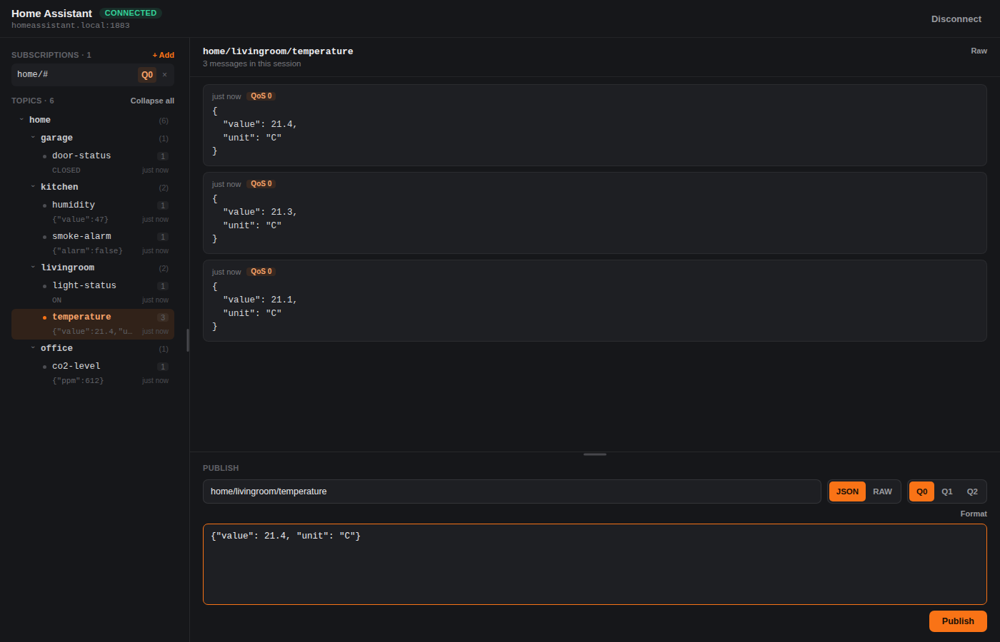
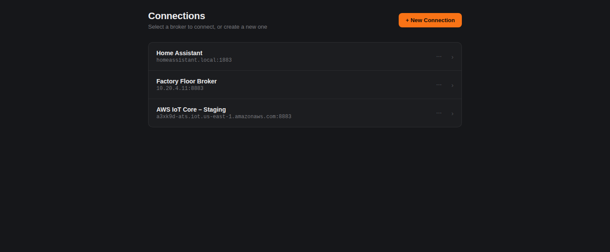
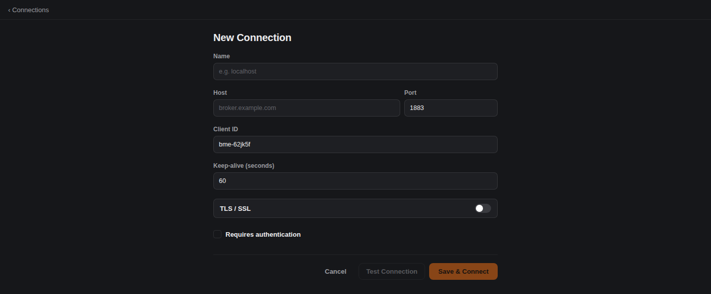

<div align="center">

# bme — Better MQTT Explorer

**A fast, native desktop client for developing against MQTT brokers.**

Connect, subscribe, watch messages roll in on a live topic tree, and publish test messages.

[](https://codeberg.org/chrissi_710/bme/actions)
[](https://codeberg.org/chrissi_710/bme/releases)
[](LICENSE)

[Download](#download) · [Roadmap](#roadmap) · [Development](#development) · [Report an issue](https://codeberg.org/chrissi_710/bme/issues)

</div>

---

## What is this?

**bme** is a desktop MQTT client built for the day-to-day work of debugging and developing against MQTT brokers: keeping a handful of broker connections on hand, watching what's flowing across a topic tree in real time, digging into a specific topic's message history, and firing off test messages.

It's built with [Tauri](https://tauri.app) (a Rust backend, SQLite for local storage, no external database or server) and [Angular](https://angular.dev) for the UI.

## Screenshots

<p align="center">
  
  <br>
  <em>Broker Workspace — subscriptions, a live topic tree, message history, and publish, all in one screen.</em>
</p>

<table align="center">
  <tr>
    <td align="center" width="50%">
      
      <br><em>Saved connections</em>
    </td>
    <td align="center" width="50%">
      
      <br><em>Adding a broker</em>
    </td>
  </tr>
</table>

### How to use it

1. **Add a broker** — `+ New Connection`, fill in host/port (and TLS or credentials if the broker needs them), then **Save & Connect** (or **Test Connection** first to sanity-check it).
2. **Subscribe** to a topic filter from the sidebar — subscriptions persist and are replayed automatically next time you connect.
3. **Browse** the live topic tree as messages arrive; click any topic to see its full session history (payload, QoS, retained flag, time received).
4. **Publish** a message from the panel on the right — topic is pre-filled from whatever you've selected in the tree, payload as JSON or raw text, pick a QoS, hit Publish.

## Download

Linux builds (AppImage, `.deb`, `.rpm`) are published on every tagged release:

**→ [codeberg.org/chrissi_710/bme/releases](https://codeberg.org/chrissi_710/bme/releases)**

No Windows or macOS build yet — see the roadmap below.

## Roadmap

Rough order of what's next, no promises on timing:

- [ ] Editing an existing broker connection (host, port, and its other settings) after it's been saved
- [ ] A message favorites feature — save frequently-used payloads for quick re-publishing, independent of any particular broker or topic
- [ ] Client certificate support for brokers that require mutual TLS
- [ ] A Windows release

Have an opinion on priority, or something else you'd want? Open an issue.

## Development

Prerequisites: [Rust](https://rustup.rs), [Node.js](https://nodejs.org) (LTS), and the [Tauri prerequisites](https://tauri.app/start/prerequisites/) for your platform.

```sh
npm install

# Run the app in dev mode (Angular dev server + Tauri window)
npm run tauri dev

# Rust workspace: lint, test, build
cargo fmt --all -- --check
cargo clippy --workspace --all-targets -- -D warnings
cargo test --workspace

# Frontend: lint, build
npm run lint
npm run build
```

CI runs the same checks on every push via Forgejo Actions (`.forgejo/workflows/ci.yml`); pushing a `v*` tag additionally builds and publishes a release.

## License

GPL-3.0-or-later — see [LICENSE](LICENSE).

---

## Acknowledgements

This project is heavily inspired by the [MQTT Explorer](https://mqtt-explorer.com/) by Thomas Nordquist. I used it almost daily at work and it's the reason I even think about MQTT traffic the way I do — the topic tree, the whole workflow. bme exists because I wanted something newer under the hood, with a few quality-of-life features I kept wishing for, not because MQTT Explorer did anything wrong.

I build this in my free time as a side project, not as a funded or full-time effort — so releases come in bursts, not on a schedule. If you run into a bug or have feedback, please [open an issue on Codeberg](https://codeberg.org/chrissi_710/bme/issues); I read and appreciate every one.
