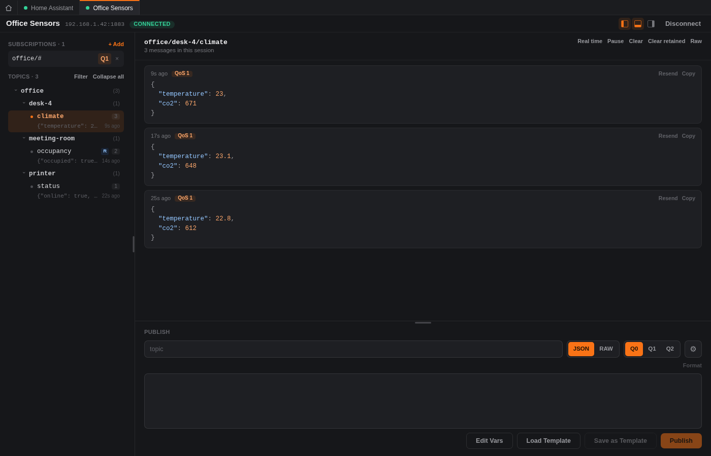
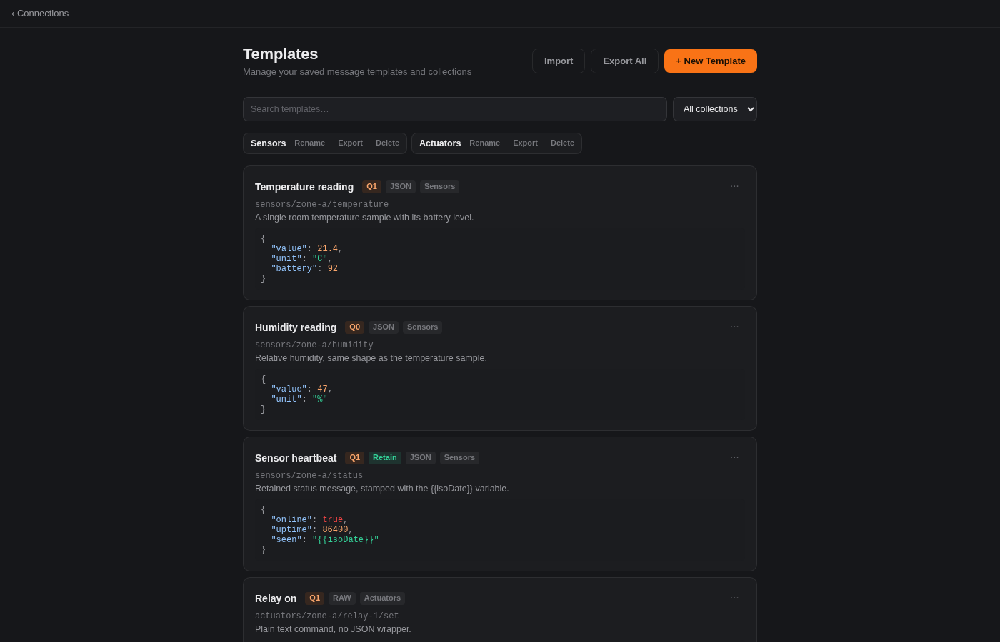
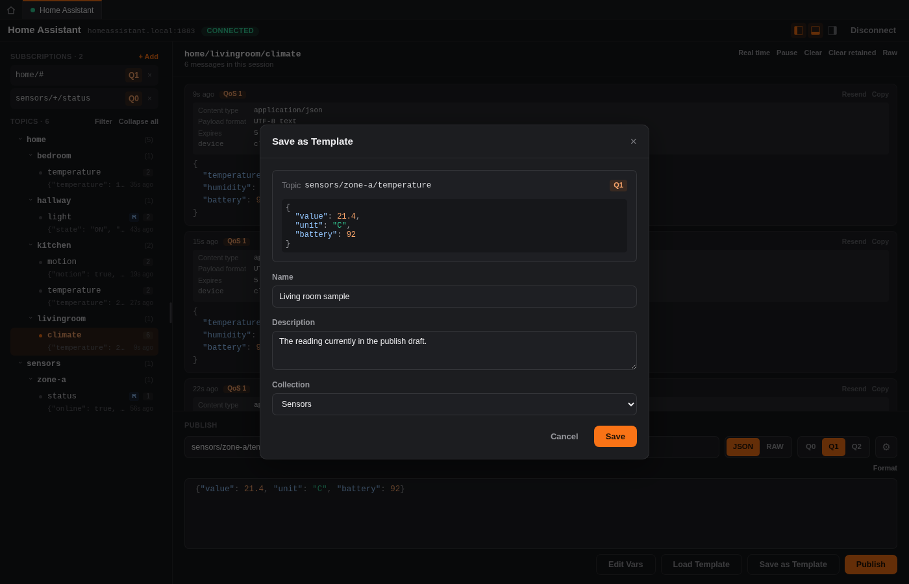
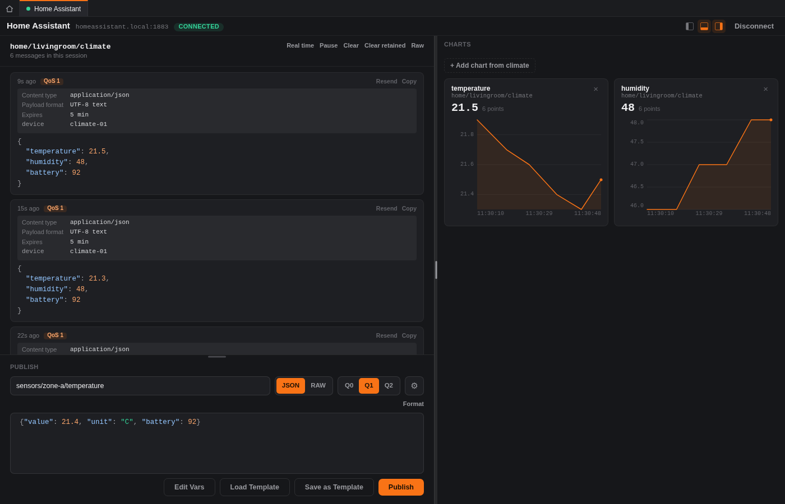
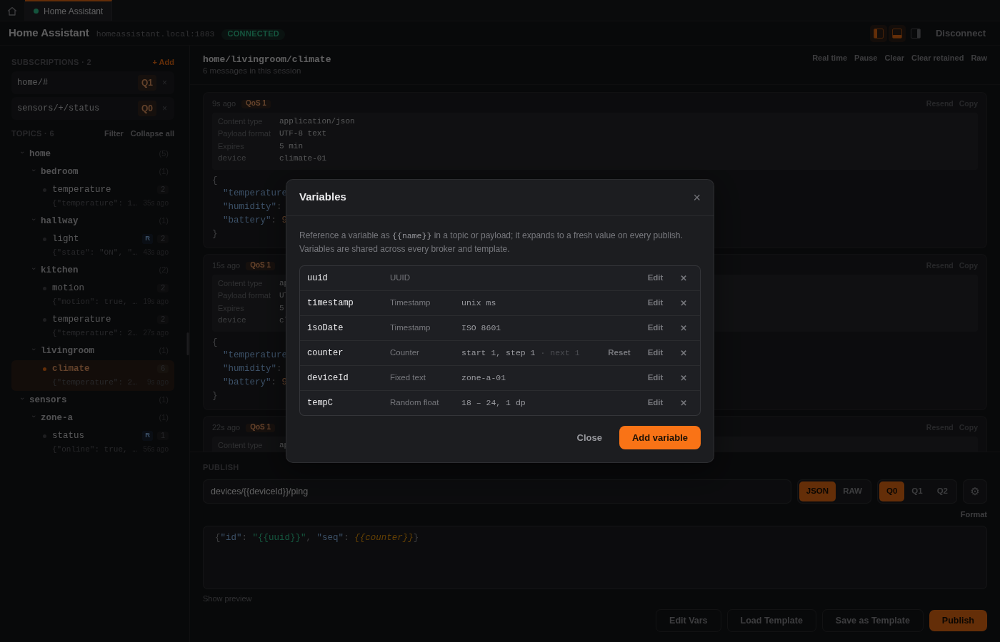
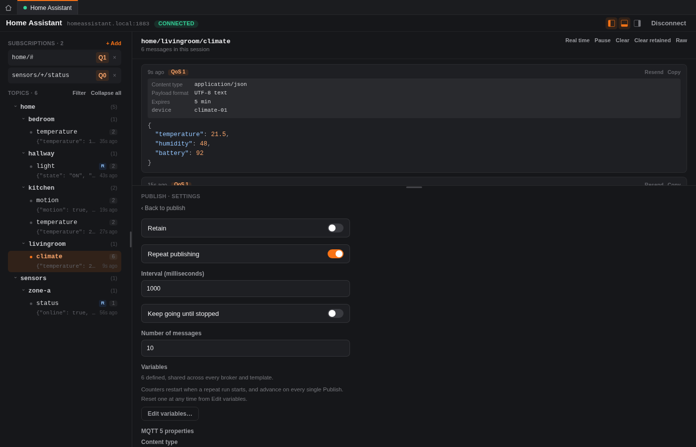

<div align="center">

# bme — Better MQTT Explorer

**A fast, native desktop client for developing against MQTT brokers.**

Connect, subscribe, watch messages roll in on a live topic tree, and publish test messages.

[](https://github.com/christoph-create/bme/actions)
[](https://github.com/christoph-create/bme/releases)
[](LICENSE)

[Download](#download) · [Roadmap](#roadmap) · [Development](#development) · [Report an issue](https://github.com/christoph-create/bme/issues)

</div>

---

## What is this?

**bme** is a desktop MQTT client built for the day-to-day work of debugging and developing against MQTT brokers: keeping a handful of broker connections on hand, watching what's flowing across a topic tree in real time, digging into a specific topic's message history, and firing off test messages.

It's built with [Tauri](https://tauri.app) (a Rust backend, SQLite for local storage, no external database or server) and [Angular](https://angular.dev) for the UI.

- **Several brokers at once** — each in its own tab, with its own history, layout and publish draft.
- **Live topic tree** — watch the hierarchy build itself as messages arrive, and click any topic for its full session history.
- **Every transport** — `mqtt://`, `mqtts://`, `ws://` and `wss://`, with client certificates, custom CAs and ALPN.
- **Message templates** — save any payload, group it into collections, and share it through an [open, versioned exchange format](spec/README.md) that isn't bme-specific.
- **Simulate a device** — `{{variables}}` expand to a fresh counter, random number, UUID or timestamp on every send, and repeat publishing turns one template into a plausible data stream.
- **Charts** — plot any numeric field in a topic's payload and watch it move.
- **Yours, locally** — connections live in a SQLite file on your machine. No account, no cloud, no telemetry; the only request bme makes on its own is a once-a-day update check.

## Screenshots

<p align="center">
  
  <br>
  <em>Broker Workspace — subscriptions, a live topic tree, message history, and publish, all in one screen. Each dock hides from its own button in the header.</em>
</p>

<p align="center">
  
  <br>
  <em>Broker tabs — keep several brokers connected at once and switch between them. Each tab keeps its own history, layout and publish draft.</em>
</p>

<table align="center">
  <tr>
    <td align="center" width="50%">
      
      <br><em>Saved connections</em>
    </td>
    <td align="center" width="50%">
      
      <br><em>Adding a broker</em>
    </td>
  </tr>
</table>

<p align="center">
  
  <br>
  <em>Templates — every saved message in one place, with collections, search, and full edit/delete.</em>
</p>

<p align="center">
  
  <br>
  <em>Save as Template — grab the current publish draft into your library, optionally into a collection.</em>
</p>

<p align="center">
  
  <br>
  <em>Charts — plot any numeric value in a topic's payload and watch it move.</em>
</p>

<table align="center">
  <tr>
    <td align="center" width="50%">
      
      <br><em>Variables behind <code>{{name}}</code></em>
    </td>
    <td align="center" width="50%">
      
      <br><em>Repeat publishing</em>
    </td>
  </tr>
</table>

### How to use it

1. **Add a broker** — `+ New Connection`, pick a scheme (`mqtt://`, `mqtts://`, `ws://`, `wss://`) and fill in host/port — plus the WebSocket path, credentials or certificates if the broker needs them — then **Save & Connect** (or **Test Connection** first to sanity-check it).
2. **Subscribe** to a topic filter from the sidebar — subscriptions persist and are replayed automatically next time you connect.
3. **Browse** the live topic tree as messages arrive; click any topic to see its full session history (payload, QoS, retained flag, time received).
4. **Publish** a message from the panel below the message stream — topic is pre-filled from whatever you've selected in the tree, payload as JSON or raw text, pick a QoS, hit Publish.
5. **Save frequently-used payloads as templates** — from the publish panel, "Save as Template" (broker-independent, optionally grouped into a collection) or "Load Template" to pull one back in. Manage the full set — edit any field, delete, or reorganize collections — from **Manage Templates** on the Connections page.
6. **Share templates and collections** — from the Templates page, **Export** a single template or a whole collection (or **Export All** for everything) as copy-pasteable JSON, and **Import** to bring one back in. It's an open, versioned format, not a bme-specific blob — see [`spec/`](spec/README.md) for the full definition.
7. **Simulate a device** — put `{{name}}` variables in the topic or payload and they expand to a fresh value on every send: a counter, a random integer or decimal in a range, a UUID, a timestamp, or a fixed string. Define them with **Edit Vars** on the publish panel, and hit **Show preview** to see exactly what the next message will carry. Turn on **Repeat** behind the ⚙ to fire the draft every N milliseconds — a fixed number of times or until you hit Stop — and one template becomes a plausible data stream instead of 500 identical messages. Counters restart when a repeat run starts and advance on every single Publish; each counter has its own **Reset** button in the variables dialog.
8. **Chart a value** — open the Tools dock from the icon buttons in the workspace header, then add any numeric field from the selected topic's payloads. Each one plots as it arrives; **Pause** freezes the stream and the charts together so you can read them.
9. **Get the space back** — those three header buttons show and hide the workspace's three docks (subscriptions on the left, publish along the bottom, tools on the right) independently, and every divider between them can be dragged.
10. **Work on several brokers at once** — opening another broker adds a tab above the header instead of replacing what you had. Each tab keeps its own history, panel layout and publish draft, and a repeating publish keeps running while you're looking at another one. **Disconnect** ends the session and closes the tab.

## Download

**→ [github.com/christoph-create/bme/releases](https://github.com/christoph-create/bme/releases)**

Every tagged release publishes builds for **x86_64 Linux** and **x64 Windows**.
There is no macOS build and no ARM build yet — on those platforms you'd need to
[build from source](#development).

| Platform | Artifact | Install |
| --- | --- | --- |
| Linux | `bme_<version>_amd64.AppImage` | `chmod +x bme_*.AppImage && ./bme_*.AppImage` |
| Linux | `bme_<version>_amd64.deb` | `sudo dpkg -i bme_*.deb` |
| Linux | `bme-<version>-1.x86_64.rpm` | `sudo rpm -i bme-*.rpm` |
| Linux (Arch) | `bme-<version>-1-x86_64.pkg.tar.zst` | `sudo pacman -U bme-*.pkg.tar.zst` |
| Windows | `bme_<version>_x64-setup.exe` | Run the installer |
| Windows | `bme_<version>_x64_en-US.msi` | Run the installer |
| Windows | `bme-<version>-windows-portable.exe` | Run it — nothing to install |

The Windows builds are unsigned, so Windows will show a SmartScreen warning
("Windows protected your PC") on first run — click "More info" → "Run
anyway" to proceed.

There's no `CHANGELOG.md` in the repo on purpose — what changed in each version
is written up on the [release itself](https://github.com/christoph-create/bme/releases).

bme checks GitHub for a newer release when it starts, at most once a day, and
tells you if there is one — with a "Skip this version" button if you'd rather
it didn't mention that one again. It never downloads or installs anything by
itself; you go to the release page and decide. There's also a
"Check for updates" button in the footer of the connections screen if you'd
rather ask than be told.

## Roadmap

Rough order of what's next, no promises on timing:

- [ ] In-app auto-update — today bme only *tells* you a release exists
- [ ] MQTT 5.0 — user properties, response topics, and real reason codes

Have an opinion on priority, or something else you'd want? Open an issue.

## Development

Prerequisites: [Rust](https://rustup.rs), [Node.js](https://nodejs.org) (LTS), and the [Tauri prerequisites](https://tauri.app/start/prerequisites/) for your platform.

```sh
npm install

# Run the app in dev mode (Angular dev server + Tauri window)
npm run tauri dev

# Rust workspace: lint, test, build
cargo fmt --all -- --check
cargo clippy --workspace --all-targets -- -D warnings
cargo test --workspace

# Frontend: lint, build
npm run lint
npm run build

# Regenerate the screenshots above from the demo fixture in src/demo/
npm run screenshots
```

CI runs the same checks on every push via GitHub Actions (`.github/workflows/ci.yml`); pushing a `v*` tag additionally builds and publishes a release.

Bug reports, ideas and pull requests are all welcome — see
[CONTRIBUTING.md](CONTRIBUTING.md) for how to get set up and what to run before
opening a PR, and the [Code of Conduct](CODE_OF_CONDUCT.md) for the ground
rules. Found a security problem? Please report it privately, following
[SECURITY.md](SECURITY.md), rather than in a public issue.

## License

GPL-3.0-or-later — see [LICENSE](LICENSE).

---

## Acknowledgements

This project is heavily inspired by the [MQTT Explorer](https://mqtt-explorer.com/) by Thomas Nordquist. I used it almost daily at work and it's the reason I even think about MQTT traffic the way I do — the topic tree, the whole workflow. bme exists because I wanted something newer under the hood, with a few quality-of-life features I kept wishing for, not because MQTT Explorer did anything wrong.

I build this in my free time as a side project, not as a funded or full-time effort — so releases come in bursts, not on a schedule. If you run into a bug or have feedback, please [open an issue on GitHub](https://github.com/christoph-create/bme/issues); I read and appreciate every one.

If bme saves you some time and you feel like saying thanks, you can
[buy me a coffee](https://buymeacoffee.com/chrissi.710). Entirely optional —
bme is free software either way, and always will be.

[](https://buymeacoffee.com/chrissi.710)
